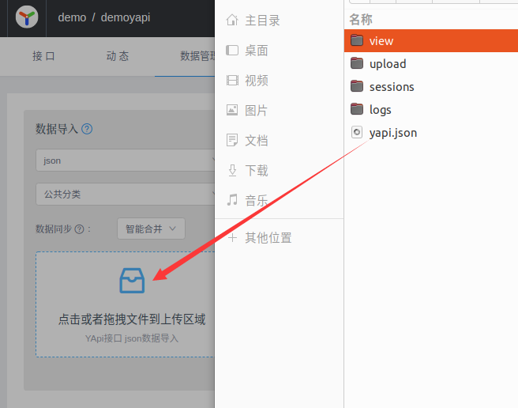
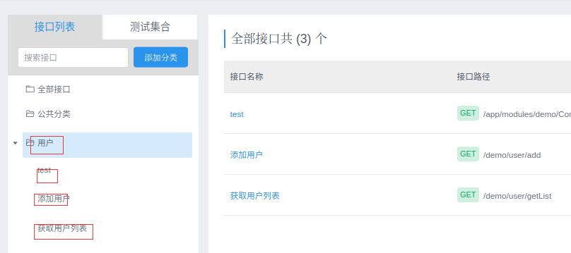

# `artisan` 命令

`artisan`命令是在命令行中，使用`php`执行一些脚本；框架内置了`list|yapi|command|make:entity|...`等脚本， 也可以自定义脚本。

- `php artisan 脚本名称 [[-option=value]...]` 运行脚本
- `php artisan 脚本名称 -h` 查看脚本使用帮助

## 导航

- [自定义脚本](#cus)
- [list](#list) 展示所有命令脚本
- [yapi](#yapi) 生成 *yapi*`json`文件
- [make:entity](#entity) 生成数据库实体模型
- [make:command](#command) 生成命令脚本
- [make:controller](#controller) 生成控制器
- [make:service](#service) 生成服务
- [make:dao](#dao) 生成dao层
- [make:aspect](#aspect) 生成切面
- [make:middleware](#middleware) 生成中间件

## <a id="cus">自定义脚本</a>

自定义脚本需要继承 `AbstractCommand`, 其命名空间是 `(framework\command\AbstractCommand)`， 实现`run`方法，要使脚本生效， 还需要在 `config/command.php` 配置文件中，配置定义号的脚本

配置eg:

```php
<?php
return [
    //脚本的类名
    \app\command\TestCommand::class,
];

```

接着在项目根目录 `php artisan` 命令运行脚本

> 快捷创建： `php artisan make:command -path=app/command -class=TestCommand -name=test`, 则会在 `app/command` 目录下创建 `TestCommand.php` 文件。`make:command` 使用详见 [make:command](#command) 部分

生成代码如下 :

```php
<?php
namespace app\command;

use framework\command\AbstractCommand;
use framework\command\Input;

class TestCommand extends AbstractCommand
{
    protected $name = 'test';

    protected $description = '';

    public function run(Input $input = null): void
    {
        //doSomething
    }

    public function optionDefinition(): array
    {
        //[['-option', 'desc'], ['-option', 'require', 'desc'] ... ]
        return [];
    }
}
```

- 属性 `name` 是脚本名称
- 属性 `description` 是对脚本的描述
- `TestCommand::run` 中是写自己的逻辑
- `TestCommand::optionDefinition` 是定义自己脚本在命令行的参数

### 定义脚本参数

脚本参数在 `optionDefinition` 方法中定义， 如果有参数， 需要返回的是一个二维数据， 每个参数是一维数据， 参数名称定义必须加 `-` 符号

```php
//--snip--
public function optionDefinition(): array
{
    //[['-option', 'desc'], ['-option', 'require', 'desc'] ... ]
    return [
        ['-name', 'require', 'name require']，  //必填参数
        ['-age', '年龄选填'] //玄天参数
    ];
}
//--snip
```

### 获取参数

参数是在`run`方法中获取， 通过 `Input` 对象获取，

- `getOption(string $name)` 通过命令行参数值
- `hasOption(string $name)` 判断是否有参数
- `getOptions()` 获取所有参数值

eg:

```php
//--snip--
    public function run(Input $input = null): void
    {
        //doSomething
        $name = $input->getOption('name');
        $age = $input->getOption('age');

        var_dump($name, $age);

        var_dump($input->getOptions());

        var_dump($input->hasOption('age'));
    }
//--snip--
```

`php artisan test -name=tomcat -age=1` 输出结果:

```txt
string(6) "tomcat"
string(1) "1"
array(2) {
  ["name"]=>
  string(6) "tomcat"
  ["age"]=>
  string(1) "1"
}
bool(true)
```

## <a id="list">list</a>

`list` 命令主要是展示所有定义好的命令， 包括框架内置+项目里面自定义命令

eg: `php artisan list` 输出结果：

```txt
                list    展示所有command
         make:entity    数据库表实体entity生成
        make:command    快速创建command文件
     make:controller    快速创建controller文件
        make:service    快速创建service文件
            make:dao    快速创建dao文件
         make:aspect    快速创建aspect AOP文件
     make:middleware    快速创建middleware文件
                yapi    yapi json导入生成工具
                test    testCommand test

```

第一列是命令名称， 第二列是命令的描述

## <a id="yapi">yapi</a>

`yapi` 命令是根据`config/yapi.php`配置文件，使用不同模块针对控制器生成对应的 *yapi json* 文件， 可用于直接在*yapi*上导入此份json文件

### 参数

option参数 | 是否必填 | 解释
- | - | -
`-module` | 是 | 模块（*config/yapi.php*配置文件中的模块）

### 配置

配置文件主要位于 `config/yapi.php`

```php
<?php
return [
    //扫描路径
    'scan_path' => [
        // 模块名称， 用于命令行参数 module
        'demo' => [
            // 模块的目录 => 所属的命名空间
            app_path() . '/modules/demo/controller' => 'app\\modules\\demo\\controller',
        ],
    ],
    //生成的json文件保存路径
    'json_path' => runtime_path(),
];
```

### 使用

`php artisan yapi -module=demo` 后，将会在 `json_path` 目录下生成 `yapi.json` 文件， 接下开就可以到 *yapi* 导入该文件，

eg 目录下 `UserController.php`:

```php
<?php
//--snip--
/**
 * Class UserController
 * @package app\modules\demo\Controller
 * @Controller(msg="用户")
 */
class UserController extends AbstractController
{
    /**
     * @RequestMapping(value="/demo/user/test", method={"get", "post"}, msg="test")
     */
    public function test()
    {}
    //--snip--
    /**
     * @param UserAddVo $vo
     * @RequestMapping(value="/demo/user/add", method={"get", "post"}, msg="添加用户")
     * @return Result
     */
    public function add(UserAddVo $vo): Result
    {
       //--snip--
    }

    /**
     * 获取用户列表
     * @param UserGetListVo $vo
     * @return Result
     * @RequestMapping(value="/demo/user/getList", method={"get"}, msg="获取用户列表")
     */
    public function getList(UserGetListVo $vo): Result
    {
       //--snip--
    }
}
```

导入：


查看：


> 每个控制器对应一个目录， 每个方法就是一个api, 后续可以在继续完善各个api文档

## <a id="entity">make:entity</a>

该命令主要用于生成数据库对应orm的实体模型文件，不必手动创建， 此外，对于已存在则实体模型文件， 也会兼容性更新已存在的文件。

### 参数

option 参数 | 是否必填 | 解释
-|-|-
`-path` | 是 | 以app_path()根目录开始,命名空间与路径对应 eg:app/entity
`-connect` | 否 | 数据库连接, 默认default (*config/datatbase.php*配置文件中的连接)
`-table` | 否 | 关联创建的数据表名,不传默认创建当前连接库下所有的表
`-class` | 否 | 需要自定义了类名,不传默认以数据表名称,传此参数旧必须传递-table参数

### 使用示例

- `php artisan make:entity -path=app/entity/test`; 在`app/entity/test` 目录下构建默认连接的所有数据表实体文件
- `php artisan make:entity -path=app/entity/other -connect=other`; 指定连接
- `php artisan make:entity -path=app/entity/test -table=demo_user`; 指定数据表，会在*path*目录生成`DemoUser.php`文件
- `php artisan make:entity -path=app/entity/test -table=demo_user -class=User`； 指定类名，会在*path*目录下生成`User.php`文件

生成的实体模型代码示例：

```php
<?php

namespace app\entity\test;

use Carbon\Carbon;
use framework\database\HeroModel;
/**
 * Class User
 * @property int $id 
 * @property string $name 
 * @property string $account 
 * @property string $password 
 * @property Carbon $created_at 
 * @property Carbon $updated_at 
 */
class User extends HeroModel
{
    protected $table = 'demo_user';
    /** @var array $fillable */
    protected $fillable = [
        //Format each item with a new line
        'id',
        'name',
        'account',
        'password',
    ];

```

### 兼容性更新实体文件

对于已存在的文件， 内容示例：

```php
<?php

namespace app\entity\test;

use Carbon\Carbon;
use framework\database\HeroModel;
use Illuminate\Database\Eloquent\Relations\HasOne;

/**
 * Class User
 * @property int $id 
 * @property string $name
 *
 * @property method relation //换行，代表用户注释，使用脚本时候就不会被清除
 * user entity
 */
class User extends HeroModel
{
    protected $table = 'demo_user';
    /** @var array $fillable */
    protected $fillable = [
        //Format each item with a new line
        'id',
        'name'，
    ];
    
    public function relation()
    {
        return $this->hasMany(Relation::class, 'user_id', id);
    }
}
```

`php artisan make:entity -path=app/entity/test -table=demo_user -class=User` 运行后，就会更新文件中的字段， eg:

```php
<?php

namespace app\entity\test;

use Carbon\Carbon;
use framework\database\HeroModel;
use Illuminate\Database\Eloquent\Relations\HasOne;
/**
 * Class User
 * @property int $id 
 * @property string $name 姓名
 * @property string $account 账户
 * @property string $password 密码
 * @property Carbon $created_at 
 * @property Carbon $updated_at 
 *
 * @property method relation
 * user entity
 */
class User extends HeroModel
{
    protected $table = 'demo_user';
    /** @var array $fillable */
    protected $fillable = [
        //Format each item with a new line
        'id',
        'name',
        'account',
        'password',
    ];
    public function relation()
    {
        return $this->hasMany(Relation::class, 'user_id', id);
    }
}
```

## <a id="command">make:command</a>

快捷生成自定义命令脚本

### 参数

option 参数 | 是否必填 | 解释
-|-|-
path | true | 以app_path()根目录开始,命名空间与路径对应 eg:app/command
class | true | command类名
name | true | command->name名称
desc | false | command描述

### 使用

`php artisan make:command -path=app/command -class=TestACommand -name=testa`； 会在 *path* 目录下生成 `TestACommand.php` 文件， 代码如下：

```php
<?php
namespace app\command;

use framework\command\AbstractCommand;
use framework\command\Input;

class TestACommand extends AbstractCommand
{
    protected $name = 'testa';

    protected $description = '';

    public function run(Input $input = null): void
    {
        //doSomething
    }

    public function optionDefinition(): array
    {
        //[['-option', 'desc'], ['-option', 'require', 'desc'] ... ]
        return [];
    }
}
```

## <a id="controller">make:controller</a>

快捷生成控制器

### 参数

option 参数 | 是否必填 | 解释
-|-|-
path | 是 | 以app_path()根目录开始,命名空间与路径对应 eg:app/modules/admin/action
class | 是 | controller类名

### 使用

`php artisan make:controller -path=app/modules/demo/controller -class=TestAController`； 会在 *path* 目录下生成 `TestAController.php` 文件， 代码如下：

```php
<?php
namespace app\modules\demo\controller;

use framework\util\Result;
use framework\core\AbstractController;
use framework\annotations\RequestMapping;
use framework\annotations\Controller;

/**
 * Class TestAController
 * @package app\modules\demo\controller
 * @Controller(msg="")
 */
class TestAController extends AbstractController
{
    public function _initialize()
    {
        //doSomething init
        //such as 配置一些局部中间件
        //$this->middleware()
    }

    /**
     * @return Result
     * @RequestMapping(value="/app/modules/demo/controller/TestAController/test", method={"get"}, msg="test")
     */
    public function test(): Result
    {
        return Result::ok();
    }
}
```

## <a id="service">make:service</a>

快捷生成服务

### 参数

option 参数 | 是否必填 | 解释
-|-|-
path | 是 | 以app_path()根目录开始,命名空间与路径对应 eg:app/modules/admin/service
class | 是 |  service类名

### 使用

`php artisan make:service -path=app/modules/demo/service -class=TestService`； 会在 *path* 目录下生成 `TestService.php` 文件， 代码如下：

```php
<?php
namespace app\modules\demo\service;

use framework\annotations\Service;

/**
 * Class TestService
 * @package app\modules\demo\service
 * @Service
 */
class TestService
{

}
```

## <a id="dao">make:dao</a>

快捷生成dao

### 参数

option 参数 | 是否必填 | 解释
-|-|-
path | 是 | 以app_path()根目录开始,命名空间与路径对应 eg:app/modules/admin/dao
class | 是 |  dao类名

### 使用

`php artisan make:dao -path=app/modules/demo/dao -class=RelationDao`； 会在 *path* 目录下生成 `RelationDao.php` 文件， 代码如下：

```php
<?php
namespace app\modules\demo\dao;

use framework\annotations\Dao;

/**
 * Class RelationDao
 * @package app\modules\demo\dao
 * @Dao
 */
class RelationDao
{

}
```

## <a id="aspect">make:aspect</a>

快捷生成切面

### 参数

option 参数 | 是否必填 | 解释
-|-|-
path | 是 | 以app_path()根目录开始,命名空间与路径对应 eg:app/aspect
class | 是 |  aspect类名

### 使用

`php artisan make:aspect -path=app/aspect -class=TestAspect`； 会在 *path* 目录下生成 `TestAspect.php` 文件， 代码如下：

```php
<?php
namespace app\aspect;

use framework\aop\AbstractAspect;
use framework\aop\interfaces\ProceedingJoinPointInterface;

/**
 * Class TestAspect
 * @package app\aspect
 */
class TestAspect extends AbstractAspect
{
    public $classes = [
        //classes
    ];

    /**
     * @param ProceedingJoinPointInterface $entryClass
     * @return mixed
     */
    public function process(ProceedingJoinPointInterface $entryClass)
    {
        //doSomething
        $res = $entryClass->process();
        //doSomething
        return $res;
    }
}
```

## <a id="middleware">make:middleware</a>

快捷生成中间件

### 参数

option 参数 | 是否必填 | 解释
-|-|-
path | 是 | 以app_path()根目录开始,命名空间与路径对应 eg:app/middleware
class | 是 |  middleware类名

### 使用

`php artisan make:middleware -path=app/modules/demo/middleware -class=TestMiddleware`； 会在 *path* 目录下生成 `TestMiddleware.php` 文件， 代码如下：

```php
<?php
namespace app\modules\demo\middleware;

use framework\http\Request;

/**
 * Class TestMiddleware
 * @package app\modules\demo\middleware
 */
class TestMiddleware
{
    public function handle(Request $request, array $vars, array $extVars, \Closure $next)
    {
        //doSomething
        return $next($request, $vars, $extVars);
    }
}
```
