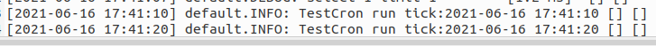

# 定时任务

定时任务也是一个自定义进程， 如果不需要可以在 *config/process* 设置 `enable = false`, eg：

```php
use app\process\CrontabTask;
//--snip--
    //定时任务
    'crontab' => [
        'enable' => false,
        'handler' => CrontabTask::class,
    ],
//--snip--
```

## 使用

### 第一步：定义定时任务

定时任务需要实现 `framework\core\ICron` 类， 并在 `onWorkerStart()` 方法中编写自己业务逻辑, eg:

```php
<?php

namespace app\cron;

use framework\bootstrap\Log;
use framework\core\ICron;

/**
 * Class TestCron
 * @package app\cron
 */
class TestCron implements ICron
{
    public function onWorkerStart()
    {
        Log::info('TestCron run tick:' . date('Y-m-d H:i:s'));
    }
}
```

### 第二步：配置

定义好定时任务后，还需要在定时任务进程处理类中配置定时任务执行时间

- 时间配置

    ```txt
    0   1   2   3   4   5
    |   |   |   |   |   |
    |   |   |   |   |   +------ day of week (0 - 6) (Sunday=0)
    |   |   |   |   +------ month (1 - 12)
    |   |   |   +-------- day of month (1 - 31)
    |   |   +---------- hour (0 - 23)
    |   +------------ min (0 - 59)
    +-------------- sec (0-59)[可省略，如果没有0位,则最小时间粒度是分钟]
    ```

- 在 `app/process/CrontabTask.php` 文件中添加定时任务执行时间， code eg:

    ```php
    <?php
   
    namespace app\process;

    use app\cron\TestCron;
    use framework\core\ICron;
    use framework\crontab\Crontab;

    class CrontabTask implements ICron
    {
        public function onWorkerStart()
        {
            // 每次间隔10s中执行一次.
            new Crontab('0/10 * * * * *', [new TestCron(), 'onWorkerStart']);
            //多个
            //new Crontab('0/10 * * * * *', [new Test2Cron(), 'onWorkerStart']);
            //new Crontab('0/10 * * * * *', [new Test3Cron(), 'onWorkerStart']);

        }
    }
    ```

### 重启服务

在日志会发现每隔10s会记录一条日志



> 注意： 定时任务是一个进程在跑， 如果有耗时比较长的定时任务，最好再配置一个定时任务进程单独处理
