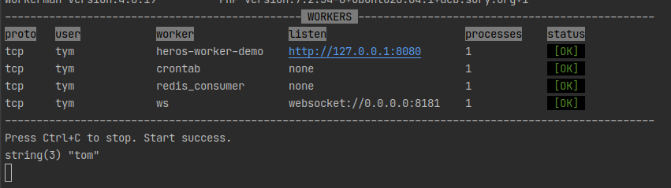

# 自定义进程

自定义进程就是一个 *workerman* - `Worker` 对象, 进程配置在 `config/process.php` 文件中， 在服务启动时候， `bin/start` 会循环读取此配置，并绑定自定义进程类中方法到 `Worker` 属性中，支持以下方法，具体可以参考 [Worker](http://doc.workerman.net/worker/on-worker-start.html)

- `onConnect($conn)`
- `onMessage($conn, $data)`
- `onClose($conn)`
- `onError($conn, $code, $msg)`
- `onBufferFull($conn)`
- `onBufferDrain($conn)`
- `onWorkerStop($worker)`
- `onWebSocketConnect($conn , $http_header)`
- `onWorkerStart($worker)`

## 实践

### 增加 `Websocket` 进程服务

- 定义一个 `websocket` 服务进程， 在 *app/process* 目录下定义 `WebSocket.php` 文件， code eg:

    ```php
    <?php
    namespace app\process;

    use Workerman\Connection\TcpConnection;

    class webSocket
    {
        public function onConnect(TcpConnection $con)
        {
            $con->send('hello');
        }

        public function onMessage(TcpConnection $con, $data)
        {
            var_dump($data);
            $con->send('receive data:' . $data);
        }

    }
    ```

- 在 *config/process.php* 配置文件中配置此进程， eg:

    ```php

    //ws服务类型
    //--snip--
    'redis_consumer' => [
        'enable' => true,
        'handler' => Consumer::class,
        'count' => 1, // 可以设置多进程
        'constructor' => [
            // 消费者类目录
            'consumer_dir' => app_path() . '/queue'
        ]
    ],
    'ws' => [
        'enable' => true,
        'listen' => 'websocket://0.0.0.0:8181',
        'handler' => \app\process\webSocket::class,
    ]
    //--snip--
    ```

    `enable` 属性是是否启动服务\
    `handler` 服务处理类\
    `constructor` 可选， 服务处理类构造参数\
    `listen` 可选，是监听协议 协议+ip+地址\
    `count` 可选，进程数量\
    `user` 可选，指定用户\
    `group` 可选，指定用户组\
    `reloadable` 可选，当前进程是否支持reload\
    `reusePort` 可选，是否复用端口\
    `transport` 可选，传输协议，tcp、udp、ssl\
    `context` 可选，上下文，像ssl需要证书配置
    `protocol` 可选，workermen 协议类名 \

- 接着重启服务， 会看到我们添加的进程：

  

- 浏览器测试：

  

- 我们终端会看到信息：

  