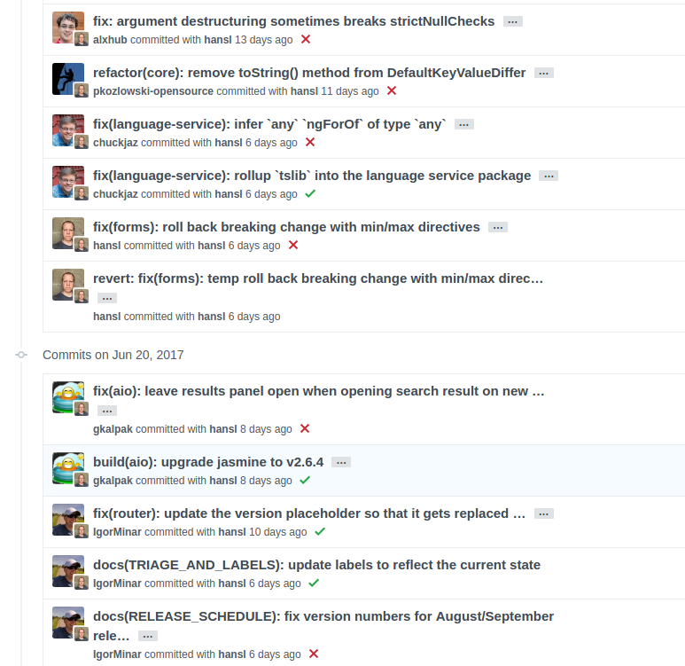

# git提交规范 #
	
## 一般来说，commit message 应该清晰明了，说明本次提交的目的。 ##


目前，社区有多种 Commit message 的写法规范。下面介绍Angular 规范（见上图），这是目前使用最广的写法，比较合理和系统化，并且有配套的工具。

每次提交，Commit message 都包括三个部分：Header，Body 和 Footer。
	
```
<type>(<scope>): <subject>// 空一行<body>// 空一行<footer>
```

其中，Header 是必需的，Body 和 Footer 可以省略。

不管是哪一个部分，任何一行都不得超过72个字符（或100个字符）。这是为了避免自动换行影响美观。

## 1. Header ##
Header部分只有一行，包括三个字段：type（必需）、scope（可选）和subject（必需）。

### 1.1 type ### 
>  type用于说明 commit 的类别，只允许使用下面7个标识。
> * feat：添加新特性
> * fix：修复bug
> * docs：文档（仅仅修改了文档）
> * style： 格式（仅仅修改了空格、格式缩进、都好等等，不改变代码逻辑）
> * refactor：重构（即不是新增功能，也不是修改bug的代码变动）
> * test：增加测试用例
> * chore：改变构建流程、或者增加依赖库、工具等

如果type为feat和fix，则该 commit 将肯定出现在 Change log 之中。其他情况（docs、chore、style、refactor、test）由你决定，要不要放入 Change log，建议是不要。
	
### 1.2 scope ### 

>	scope用于说明 commit 影响的范围，比如数据层、控制层、视图层等等，视项目不同而不同。

### 1.3 subject ### 
> * subject是 commit 目的的简短描述，不超过50个字符。
> * 以动词开头，使用第一人称现在时，比如change，而不是changed或changes。
> * 第一个字母小写。
> * 结尾不加句号（.）


## 2. Body ##
Body 部分是对本次 commit 的详细描述，可以分成多行。下面是一个范例。

```
 More detailed explanatory text, if necessary.  Wrap it to about 72 characters or so. Further paragraphs come after blank lines.- Bullet points are okay, too- Use a hanging indent
 ```

有两个注意点：
1. 使用第一人称现在时，比如使用change而不是changed或changes。
2. 应该说明代码变动的动机，以及与以前行为的对比。

## 3. Footer ##
Footer 部分只用于两种情况。

### 3.1 不兼容变动 ### 
	
如果当前代码与上一个版本不兼容，则 Footer 部分以BREAKING CHANGE开头，后面是对变动的描述、以及变动理由和迁移方法。

### 3.2 关闭 Issue ### 

如果当前 commit 针对某个issue，那么可以在 Footer 部分关闭这个 issue 