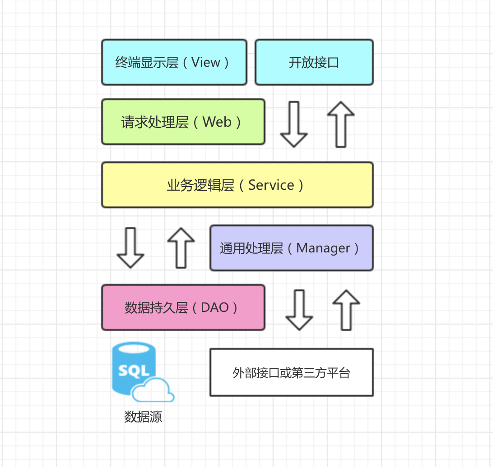

# 应用分层
1. **【强制】** 图中默认上层依赖于下层，箭头关系表示可直接依赖，如：开放接口层可以依赖于 Web 层，也可以直接依赖于 Service 层，依此类推：

* **开放接口层:** 可直接封装 Service 方法暴露成 RPC 接口；通过 Web 封装成 http 接口；进行网关安全控制、流量控制等。

* **终端显示层:** 各个端的模板渲染并执行显示的层。当前主要是 html 模板渲染，JS 渲染，移动端展示等。

* **Web 层:** 主要是对访问控制进行转发，各类基本参数校验，或者不复用的业务简单处理等。

* **Service 层:** 相对具体的业务逻辑服务层。

* **Manager 层:** 通用业务处理层，它有如下特征:
	> 1. 对第三方平台封装的层，预处理返回结果及转化异常信息; 
	> 2. 对Service层通用能力的下沉，如缓存方案、中间件通用处理;
	> 3. 与DAO层交互，对多个DAO的组合复用。

* **DAO 层:** 数据访问层，与底层 MySQL、Oracle、Hbase 进行数据交互。

* **外部接口或第三方平台:** 包括其它部门 RPC 开放接口，基础平台，其它公司的 HTTP 接口。